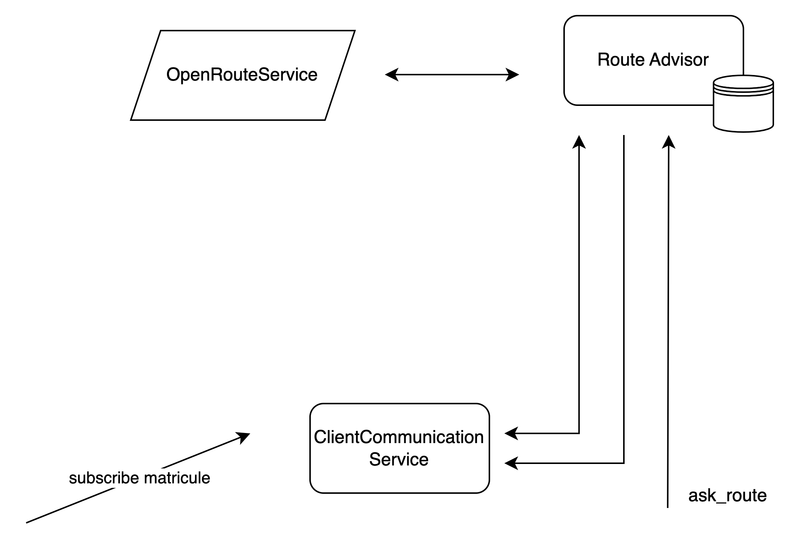
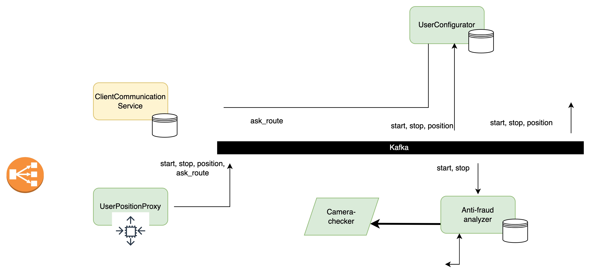
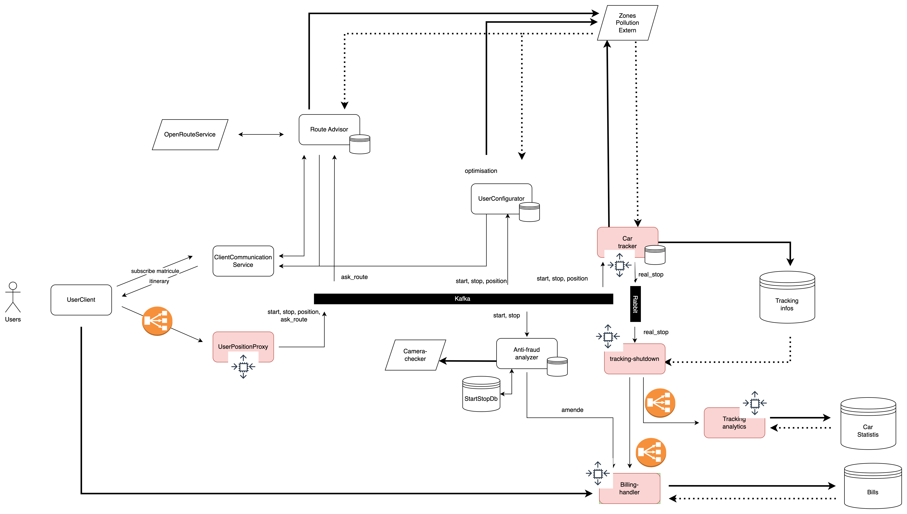
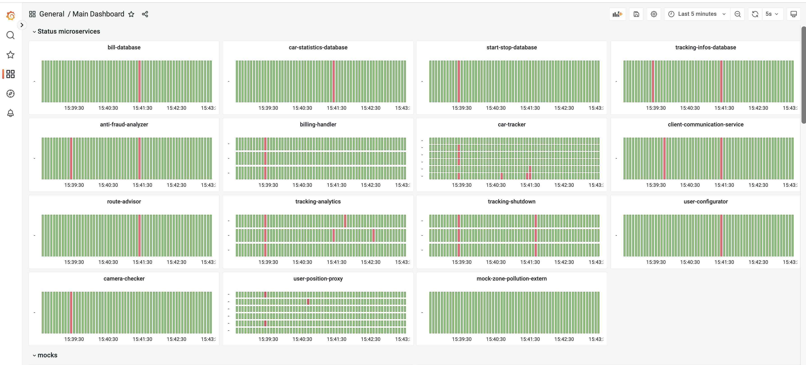
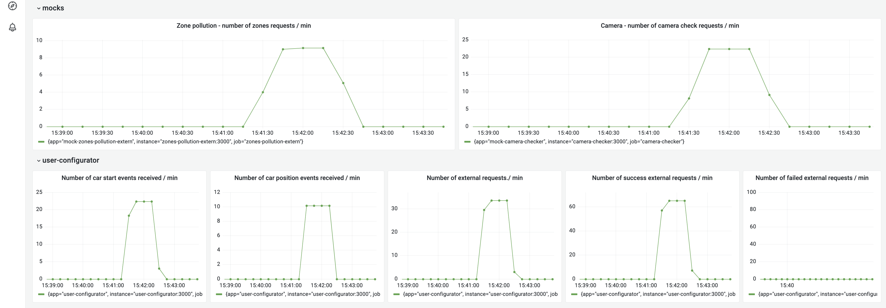
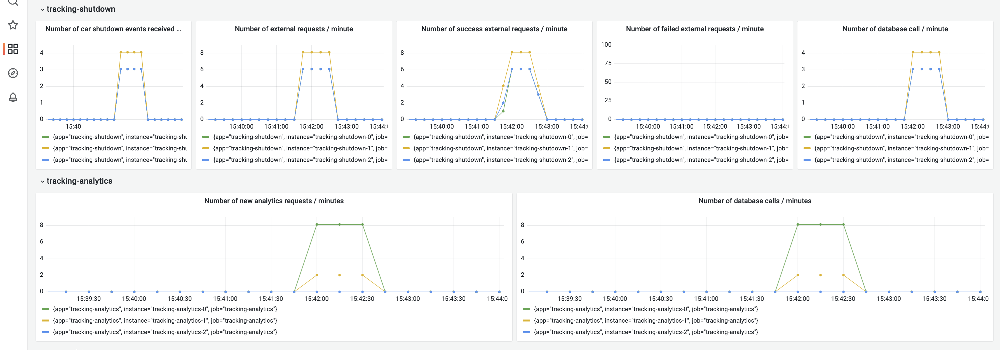
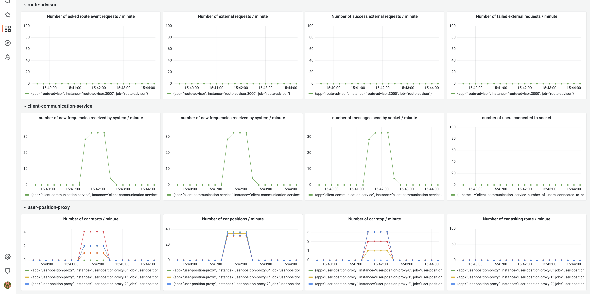
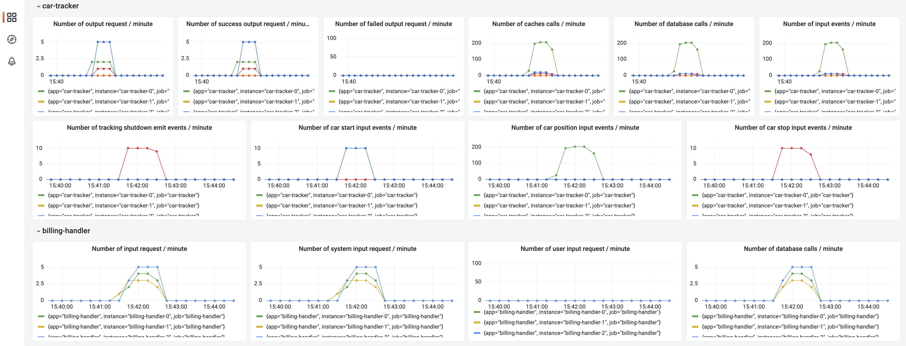
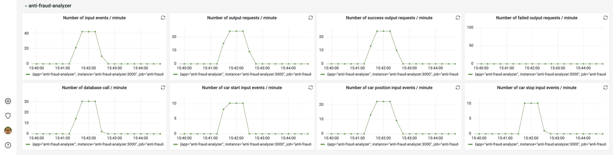

# 11. Changement du système de GPS
###### ? janvier 2022

## Status
ACCEPTED

## Context

Nos utilisateurs doivent avoir une remontée en temps reel de leur itinéraire ainsi que de leur potentiel prix de billing. 
Du fait du temps que cela à pris, nous avons du prendre une décision de simplification du système de retour d'itinéraire

## Decision

Nous allons configurer le front-end pour que ce soit l'utilisateur qui demande un nouveau tracé d'itinéraire. C'est-à-dire
que toutes les 30 secondes, une boucle dans notre frontend va faire une requête à `user-position-proxy` qui emettra
un message dans le bus dans un topic particulier que `route-advisor` écoutera, générera un nouvel itinéraire grâce au 
service `open-route-service` qui est un container docker donné par OpenStreetMap (hébergé 100% en local), et enverra
cet itinéraire à `client-communication-service` qui s'occupera ensuite de le renvoyer à l'utilisateur par Socket. 

## Consequences

Nous n'avons pas besoin d'implémenter un algorithme de suivi de l'utilisateur qui regarde s'il dévie de sa route. Cependant,
cela augmente la charge sur `route-advisor` et `client-communciation-service`. 

# 10. Régulation du nombre de messages destiné au test de fraude et d'optimisation
###### 14 janvier 2022

## Status
ACCEPTED

## Context

Lors de la montée en charge, les services `user-configurator` et `anti-fraud-analyzer recoivent le même montant de charge
que car-tracker alors que ce sont des services "non-essentiels", car notre mission principale est d'enregistrer les trajets des
utilisateurs

## Decision
!
Plusieurs choix possibles : 
- Limiter le nombre de messages qui rentre dans les services via un timer Kafka ou un offset (que l'on gère directement
dans la configuration Kafka)
- Scaler horizontalement les microservices pour qu'ils tiennent la charge
- Dans user-position-proxy, n'envoyer qu'un message sur N dans un topic différend de `car-position`

L'option 1 n'est pas très intuitive pour un utilisateur, il est difficile pour lui de faire le lien entre le temps d'offset
et le nombre de messages qui arrivera dans les services, tandis que l'option 3 est plus intuitive, il pourra directement
configurer le pourcentage de message qui arrive dans les services (exemple : 10%). L'option 2 est également intéressante,
mais ce n'est pas l'objectif de devoir scaler ces 2 microservices tout autant que `car-tracker`, de plus, `camera-checker`
est un service externe, il est de notre devoir de ne pas le surcharger. 

Nous trouvons que le fait de prendre que un message sur 10 est judicieux, car il permet tout de même de faire de la configuration
et de l'analyse de fraude, de manière significative, et le fait de l'implémenter dans user-position-proxy, cela permet
à la smartcity de réguler en fonction des heures d'affluences. De plus, nous pourrons potentiellement le scaler. 

## Consequences

Du fait de ce choix, nous devons ajouter un calcul au niveau de user-position-proxy (qui ne devient donc plus qu'un simple proxy)
mais, cela entraînement un scale plus facile par la suite.

# 9. Scaling des micro-services essentiels à la remontée de position (domaine métier principal)
###### 13 janvier 2022

## Status
ACCEPTED

## Context

Sans aucun scale, notre service ne tient pas la charge, et, du fait de ce problème, les données placées en DB sont
incohérentes, ce qui nuit grandement à lka smartcity car elle ne peut pas se fier aux données délivrées par notre
service.

## Decision

Nous avons fait le choix de 
- mettre un load-balancer devant `user-position-proxy` et de le scaler à 6 réplica. 
- mettre un load-balancer devant `tracking-analytics` et de le scaler à 3 réplicas.
- mettre un load-balancer devant `billing-handler` et de le scaler à 3 réplicas.
- de scaler car-tracker à 6 réplica
- de scaler tracking-shutdown à 3 réplica

Nous avons fait le choix de 6 réplica et 3 réplica car nous pensons qu'il y aura 3 fois plus de remonté de positions que
de stops (donc 2 replica de `tracking-shutdown` pour 6 réplica de car-tracker). Cependant, ces 2 services `tracking-shutdown`
et les 2 services qui en découlent sont relativement vulnérable, et nous ne pouvons pas nous permettent qu'ils tombent tous
en même temps sinon nous n'auront pas de remonté d'information à la ville. Nous le scalons ainsi avec un replica de plus. 

## Consequences
Nous devons configurer les load-balancer, scaler les instances, configurer prometheus et grafana pour bien afficher
les instances. De plus nous devons configurer Kafka pour que les 6 instances de `car-tracker` ne consomment qu'un message
à la fois, nous devons donc les mettre dans le même consumer groupe (ce fut relativement simple honnêtement)

# 8. Implémentation de nombreuses metrics relatives à Prometheus et Grafana
###### 10 janvier 2022

## Status
ACCEPTED

## Context

Afin de réaliser au mieux les tests de charges, nous voulons une interface Grafana avec des métrics relatives à notre
domaine métier.

## Decision
Il a été décidé d'implémenter des métriques relatives à notre domaine métier (nombre de messages start / positions / stop)
mais aussi par rapport à notre architecture afin de monitorer l'endroit où nous pourrions avoir des problèmes. De plus
un gros effort a été fait sur la partie qui analyse si les services sont up/down pour visualiser clairement quels 
services tombent dans le but de moduler au mieux l'architecture (un point represente 5 secondes)

## Consequences

Du fait de ce choix, nous devons ajouter un calcul au niveau d'`user-position-proxy` (qui ne devient donc plus qu'un simple proxy)
mais, cela entraînement un scale plus facile par la suite.

# 7. Implémentation d'un système d'itinéraire
###### 13 décembre 2022

## Status
ACCEPTED

## Context

Dans les nouvelles user-stories, il est demandé d'avoir un retour à l'utilisateur de son itinéraire en direct, afin qu'il 
puisse s'orienter dans la ville, mais aussi (et surtout), d'avoir une estimation de combien va lui couter son trajet.

## Decision

Ce système étant relativement compliqué, il requiert plusieurs communications. Quand un utilisateur rentrera sa destination
il émettra cette destination dans le socket qui ensuite communiquera au service `route-advisor` de la destination de cet
utilisateur. Ce service mettre en cache cette destination, générera un itinéraire, et le renverra a `client-communication-service`
qui ensuite remontera l'itinéraire à l'utilisateur via le socket. Le calcul de cet itinéraire inclue une estimation
du prix en fonctions des zones (donc communication à `zone-pollution-externe` comme l'ADR #6). Il utilisera un autre service
`open-route-service` qui permet la génération d'itinéraire via une image docker

`route-adivsor` va ensuite lire les positions de la voiture dans le bus et toutes les 10 positions, il recalculera
un itinéraire qu'il enverra à `client-communication-service`. Cette hypothèse très forte nous permet d'éviter d'implémenter
un algorihtme d'interpolation de points, cependant il demandera énormément de ressources, c'est pour cela que nous
ne prenons qu'un point sur 10. De plus, en regardant 1 point sur 10 et en recalculant l'itinéraire, nous pouvons être 
sûr que l'utilisateur aura une estimation du prix de son trajet relativement fiable. 

## Consequences

Cette partie sera difficile à scaller, car elle sera stateful, nous pourrons donc penser à la scaler verticalement
plutot que horizontalement. 

# 6. Ajout d'un cache à `user-configurator` et remonté d'information
###### 13 décembre 2022

## Status

ACCEPTED

## Context

Le micro-service `user-configurator` a pour objectif principal l'optimisation de notre implémentation. Il a pour
unique objectif de dire au client 'tu dois m'envoyer ta position toutes les N secondes' afin de ne pas surcharger
notre bus. 

## Decision

Avant, tout comme `car-tracker`, il était en liaison directe avec `zone-pollution-externe`, cependant, cela peut-être lourd
de faire énormément de requêtes, nous avons donc décidé de conserver les données de `zone-pollution-externe` en cache, de la même 
manière que précédemment (voir ATR #4).

De plus, maintenant que nous communiquons des informations au client via `client-communication-service`, ce retour se fait via
route POST, qui sera ensuite envoyé par l'intermédiaire du socket

## Consequences

Ce système est un système d'optimisation, il n'est pas donc pas nécessaire de le scaler tout le temps, dans le futur, nous
pourrions réfléchir à d'autres optimisations afin de ne pas surcharger le système (prendre que une position sur 10 par exemple)

# 5. Simplification du système d'anti-fraude
###### 13 décembre 2022

## Status
ACCEPTED

## Context

Dans la première partie du bimestre, nous ne nous étions pas penchés sur le sujet du système de fraude en détail
car il était concidéré comme un système supplémentaire et d'optimisation, cependant, il est nécessaire maintenant
de l'implémenter pour assurer la sécurité de notre système.

## Decision

Nous avons décidé de simplifier au maximum cette première itération de système d'anti-fraude, tout en essayant
de rendre le système le plus fiable possible. Ce choix est fait pour que l'on n'ait pas besoin de trop scaler
ce micro-service. 

Le but est que `anti-fraud analyzer` récupère une position de voiture sur 10 dans le bus. Ensuite, il va questionner 
`camera-checker` en demandant si cette voiture est bien dans cette zone, si `camera-checker` lui dit qu'en fait cette voiture
n'est pas détecté dans cette zone, nous savons que cette voiture essaye de frauder

Le second système de vérification de fraude, est que ce système va aller lire les topics 'start' et 'stop' du
bus KAFKA, et il va mémoriser ces informations en mémoire (dans la base de donnée `StartStopDb`). Cette DB
est implémenté grace à mongoDB sous une forme de clé valeur, ce choix a été fait de manière arbitraire, car
nous avions déjà implémenté des mongoDB dans le projet, et nous ne voulions pas perdre de temps à implémenter
une autre technologie, afin de se concentrer sur le reste. 

## Consequences

Il va falloir également scaller `anti-fraud analyzer` car il pourra être soumi a une grande charge. Cependant,
dans le futur, nous pourrions trouver des optimisations possibles, parce que le choix des 1 position sur 10 est totalement
arbitraire. 

# 4. Changement de l'implémentation de `zones-pollution-extern`
###### 5 décembre 2022

## Status

ACCEPTED

## Context

Après nous être rendu compte que notre goulot d'étranglement se situé au niveau de `car-tracker` (quand énormément
de positions sont envoyés à travers le bus), et que ce goulot d'étraglement était en partie due au fait que celui-ci
faisait, pour chaques positions, une requête à `zones-pollution-extern` pour connaitre la zone dans laquelle se situe
la voiture, nous avons décidé d'externaliser un peu cette fontionnalité afin d'avoir de meilleures performances

## Decision

Nous allons donc diminuer la responsabilité de notre mock `zones-pollution-extern`. En effet, celui-ci ne conservera
juste que les données relatives aux zones (coordonnées de chaques zones). Ce sera au `car-tracker` de faire
les calculs pour voir dans quelle zone se situe la voiture. `car-tracker` fera ainsi qu'une seule requête à
`zones-pollution-extern` et conservera en cache les informations des zones (un cache interne à NestJS, car nous ne pensons pas qu'il soit
nécessaire d'implémenter un cache Reddis, dans la mesure où nous allons stocker moins de 10 zones, et que NestJS
a une fonctionnalité de cache relativement puissante). Nous faisons également ce choix, parce que le calcul de savoir dans 
quelle zone est une voiture est très simple et notre micro-service NestJS sera beaucoup plus rapide à faire ce calcul
plutot que de faire une requête HTTP. 

## Consequences

Cela permettra d'avoir un système plus rapide, et d'éviter un goulot d'étranglement au niveau de `car-tracker`. Mais
également, `zones-pollution-extern` pourra envoyer ses données de zones à d'autres micro-services. 

# 3. Implementation du service d'analytics
###### 5 décembre 2022

## Status

ACCEPTED

## Context
Suite a une nouvelle user-stories, nous devons conserver une trace de tous les trajets effectués par les 
utilisateurs, afin de permettre a la ville de réaliser des statistiques sur ces trajets

## Decision

Nous avons décidé pour cela de créer un nouveau micro-service qui se situe en sortie de tracking-shutdown.
Avant que tracking-shutdown supprime les données dans la base de donnée `Tracking-infos`, il envoie les
positions à tracking-analytics qui va les stocker dans une base de donnée `car-statistics`

Cette base de donnée est implémentée en MongoDB car nous voulions une approche document dans la mesure
où nous allions potentiellement rajouter des données aux trajets (afin de faire des analyses par exemple),
et nous ne voulions donc pas être contraint par un modèle de donnée relationnel très stricte. De plus, 
le fait que l'on puisse la scaler assez facilement, mais que l'on puisse également exporter très simplement
les données au format JSON est très utile pour faire des analyses derrière (on pourrait donner ce JSON a des 
data-scientists)

## Consequences

Il va donc falloir ajouter à `tracking-shutdown` la responsabilité d'envoyer les données d'un trajet à ce micro-service,
dans la mesure ou cette liaison est en REST, tracking-shutdown devient de moins en moins stateless, dans la mesure
ou il doit attendre la confirmation de bonne réception des données par `tracking-analytics` pour supprimé les données
en DB.

# 2. Modification de notre "interface utilisateur"
###### 5 décembre 2022

## Status

ACCEPTED

## Context
Dans notre première implémentation de code, nous n'avions pas d'interface graphique. Cependant, avec l'arrivée
de nouvelle user-stories, il est nécessaire d'afficher des infos relatives à un itinéraire, nous devons donc avoir une
interface graphique

## Decision

Nous allons créer une application React qui permettra l'afficahe de :
- bouton de démarrage et d'arrêt de la course
- l'itinéraire en cours (si nous avons choisi un itinéraire)
- une estimation du montant dépensé pendant la course 
- avoir accès à ses factures

## Consequences

* Maintenant que nous avons un vrai front-end et plus une application NestJS, pour la remonté d'information du système 
vers l'utilisateur, nous devons créer un socket entre notre serveur et le client. Pour cela nous implementons
`client-communication-service`. Au démarage d'un ride, le client ouvrira un socket privée avec ce micro-service,
et tout nos autres services enverront des informations relatives a ce client à `client-communication-service` ( remontée
d'itinéraire, remontée d'information sur le montant dépensé, remontée sur la fréquence d'envoie de position) qui s'occupera
ensuite d'envoyer cette information par le socket au client

* De plus, notre client doit toujours envoyé sa position en temps réel au système, c'est pour cela que nous
avons décidé d'implémenter le service `user-position-proxy`. Le `user-client` enverra sa position via une route
REST à `user-position-proxy` et ensuite celui-ci emettra cette position dans le bus.

* Ce choix de séparer les 2 a été fait car il va y avoir beaucoup plus de remonté d'informations du client
au serveur que du serveur au client. `user-position-proxy` étant 100% stateless, il sera très facile de le scaller,
tandis que `client-communication-service` sera légèrement statefull dans la mesure ou il aura un socket ouvert, il sera donc beaucoup 
plus difficile à scaler. Cette implémentation nous permet donc de scaler intelligemment en limitant la difficulté de ce scale

# 1. Modification de la Queue RabbitMQ en un bus événementiel Kafka
###### 5 décembre 2022

## Status
ACCEPTED

## Context
Dans la première version de notre projet, notre Queue n'étais utilisé que pour transmettre la position d'une voiture de 
notre client jusqu'à notre micro-service `car-tracker`. Cependant, maintenant nous avons plusieurs micro-services qui doivent
écouter cette position, et donc une Queue n'est plus optimale, il faut passer à un bus événementiel

## Decision

Nous sommes passé de la technologie RabbitMQ à la technologie de bus événementiel Kafka, dans la mesure 
ou nous connaissions déjà cette technologie, nous l'avions déjà utilisé. De plus, de part ses différents topics,
cette technologie nous permet de bien distingué plusieurs segments de données (start d'une voiture, position d'une
voiture, stop d'une voiture)

## Consequences

Nous devons modifier notre micro-service car-tracker afin qu'il puisse lire les messages Kafka au lieu des messages
de la queue RabbitMQ. Nous conservons cependant la Queue entre car-tracker et tracking-shutdown, afin de ne pas
faire trop de modification à l'implémentation existente, mais également car le fait que car-shutdown consomme le message
est utile pour notre implémentation car car-shutdown a également la responsabilité de nettoyer la base de donnée 
tracking-infos

##################################################################################

# Title
###### 5 décembre 2022

## Status

What is the status, such as proposed, accepted, rejected, deprecated, superseded, etc.?

## Context

What is the issue that we're seeing that is motivating this decision or change?

## Decision

What is the change that we're proposing and/or doing?

## Consequences

What becomes easier or more difficult to do because of this change?
